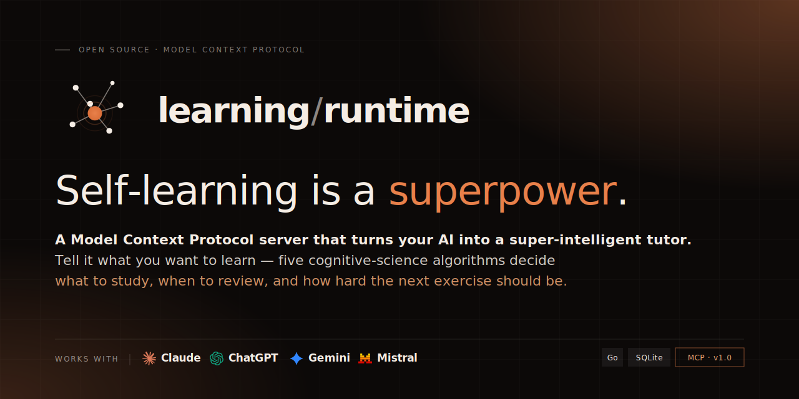

<p align="center">
  
</p>

<p align="center">
  <a href="./LICENSE"></a>
  <a href="https://go.dev/"></a>
  <a href="https://modelcontextprotocol.io/"></a>
  <a href="https://github.com/ArnaudGuiovanna/tutor-mcp/releases"></a>
  <a href="https://github.com/ArnaudGuiovanna/tutor-mcp/issues"></a>
</p>

# Tutor MCP — Open-Source AI Tutor & Intelligent Tutoring System (ITS) for LLMs

> Self-hosted **AI tutor** runtime that turns any LLM (Claude, ChatGPT, Le Chat, Gemini) into a true **Intelligent Tutoring System (ITS)** — grounded in cognitive science (BKT, FSRS, IRT, PFA, KST, Rasch/Elo calibration) and exposed over the [Model Context Protocol (MCP)](https://modelcontextprotocol.io/). Adaptive learning, spaced repetition, mastery tracking, misconception diagnosis, transfer checks, pedagogical audit trails and a metacognitive loop — for any subject, with no item bank to curate.

**Tutor MCP is the adaptive brain behind a personalised tutor.** You tell an LLM (Claude, ChatGPT, …) what you want to learn — *Spanish for travel*, *Go for backend*, *options trading*, *medieval history* — and the runtime orchestrates the journey end-to-end: what to study next, when to review, how hard the next exercise should be, when you've mastered a concept, when you're losing motivation, when you're ready to be more autonomous. It works on **any subject the learner can describe in natural language** — no content catalog, no curation, no editorial backlog.

Under the hood, it provides real-time cognitive state tracking, spaced-repetition scheduling, regulation-pipeline orchestration, misconception diagnosis, structured rubrics, transfer profiling, a motivation layer, and a metacognitive loop that helps learners become autonomous — all exposed as a [Model Context Protocol (MCP)](https://modelcontextprotocol.io/) server that any MCP-compatible LLM can drive.

> Current release: **v0.3.1** — the regulation pipeline is the single runtime engine, and the learner model now includes structured evidence gates, pedagogical snapshots, client-initiated learner memory, consolidation requests, transfer profiles, individualized BKT parameters, and Rasch/Elo exercise calibration signals.

## Table of Contents

- [An Intelligent Tutoring System, not a chatbot](#an-intelligent-tutoring-system-not-a-chatbot)
- [Compatible MCP clients](#compatible-mcp-clients)
- [Design Choice — The LLM is the Content Engine](#design-choice--the-llm-is-the-content-engine-the-runtime-is-the-its)
- [How It Works](#how-it-works)
- [Cognitive Science Engine](#cognitive-science-engine)
- [Pedagogical Reliability & Auditability](#pedagogical-reliability--auditability)
- [Regulation Pipeline (v0.3)](#regulation-pipeline-v03)
- [MCP Tools](#mcp-tools)
- [Alert, Motivation, Webhook engines](#alert-engine)
- [Authentication](#authentication)
- [Architecture](#architecture)
- [Running](#running)
- [Capacity & Sizing](#capacity--sizing)
- [Server Configuration](#server-configuration)
- [Tech Stack](#tech-stack)
- [Operations](#operations)
- [Roadmap](#roadmap)
- [Contributing](#contributing)
- [Security](#security)
- [Acknowledgments](#acknowledgments)
- [License](#license)
- [Author](#author)

## An Intelligent Tutoring System, not a chatbot

For 50 years, **Intelligent Tutoring Systems (ITS)** research — Anderson, VanLehn, Koedinger and others — has converged on four pillars: a **domain model**, a **learner model**, a **pedagogical model**, and an **interface**. Generic LLM chat covers only the last one. Tutor MCP supplies the first three as a deterministic runtime, and delegates the interface and the natural-language content to the LLM:

| ITS pillar | Provided by | How |
|------------|-------------|-----|
| **Domain model** | Tutor MCP runtime | Concept graph with prerequisites, validated by **KST** (Knowledge Space Theory) |
| **Learner model** | Tutor MCP runtime | Mastery, ability, recall and transfer predicted by **BKT** (Bayesian Knowledge Tracing), **IRT** (Item Response Theory), **Rasch/Elo**, **PFA** (Performance Factor Analysis) and structured transfer profiles |
| **Pedagogical model** | Tutor MCP runtime | Spaced-repetition scheduling via **FSRS** (Free Spaced Repetition Scheduler), evidence-gated mastery, regulation orchestrator, alert engine, motivation engine, metacognitive loop |
| **Interface & content** | Any MCP-compatible LLM | Claude, ChatGPT, Le Chat, Gemini — generates exercises, hints, feedback and dialogue on demand |

The cognitive science is rigid and measurable; the LLM is infinitely flexible. Together they make an ITS that works on day one for any topic — without an editorial team.

## Compatible MCP clients

Tutor MCP works out of the box with the main MCP-capable assistants — connect it to any of them via a custom connector (see [Setup workflow](#setup-workflow)).

<p align="left">
  <a href="#claude-claudeai"></a>
  &nbsp;&nbsp;&nbsp;&nbsp;
  <a href="#chatgpt"></a>
  &nbsp;&nbsp;&nbsp;&nbsp;
  <a href="#le-chat-mistral"></a>
  &nbsp;&nbsp;&nbsp;&nbsp;
  <a href="#gemini"></a>
</p>

## Design Choice — The LLM is the Content Engine, the Runtime is the ITS

Traditional learning platforms (Duolingo, Anki, Khan Academy) and most "AI tutor" demos are bounded by their item banks: once the catalog is exhausted, the system stops. Tutor MCP takes the opposite bet.

> The LLM is trained on humanity's knowledge. It is the most flexible content generator that has ever existed. The runtime never stores exercises — it generates them on demand, calibrated in real time to the learner's mastery, ability, affect, and personal goal.

- **Domains and prerequisite graphs** are co-authored by the learner and the LLM at `init_domain` time — not pre-curated.
- **Exercises, explanations, hints, feedback, motivational nudges** — all generated on the fly by the LLM.
- The **runtime** brings the cognitive science of an ITS: BKT, FSRS, IRT, PFA, KST, Rasch/Elo calibration, transfer modeling, evidence gates, an alert engine, a motivation engine, and a metacognitive loop.
- The **LLM** brings infinite domain breadth and on-demand calibration.

This is what makes the system work on day one for any topic — and what lets it scale without an editorial team.

## How It Works

The server sits between a learner and an LLM. Three parallel loops run from the first session:

**Learning loop** (what to learn, when) — The LLM calls MCP tools before and after every exchange to get the next optimal activity and record interactions. The runtime updates mastery, recall, ability, exercise calibration and transfer evidence in real time. The LLM never invents its own scheduling.

**Metacognitive loop** (how the learner learns) — Affect check-ins, calibration tracking, and autonomy metrics observe the learner's relationship to the system. A mirror mechanism surfaces factual observations about dependency patterns without judging. The system aims to make itself progressively unnecessary.

**Motivation loop** (why this matters) — A brief engine selects a single motivational angle per exercise (milestone, competence value, growth mindset, affect reframe, plateau recontextualization, or utility value linked to the learner's personal goal). The LLM composes the text from structured signals; the system never emits canned pep talk.

## Cognitive Science Engine

Complementary learning-science algorithms run on every interaction and jointly inform the regulation orchestrator (`engine/orchestrator.go`; design notes in [`docs/regulation-design/`](./docs/regulation-design/)). Together they form the learner-and-pedagogical model of the ITS.

| Algorithm | Role |
|-----------|------|
| **BKT** (Bayesian Knowledge Tracing) | Tracks mastery probability per concept. Error-type heuristics and recent-history profiles individualize `P(Learn)`, `P(Slip)` and `P(Guess)` without letting the LLM tune them. |
| **FSRS** (Free Spaced Repetition Scheduler) | Schedules reviews using stability/difficulty curves. Determines optimal review intervals. |
| **IRT** (Item Response Theory) | Estimates learner ability (θ) from response patterns. Calibrates exercise difficulty. |
| **Rasch/Elo** | Lightweight deterministic calibration signal for learner ability vs. exercise difficulty; exposed to the LLM as an item-design hint and stored in snapshots. |
| **PFA** (Performance Factor Analysis) | Weights success/failure history to predict performance on each concept. |
| **KST** (Knowledge Space Theory) | Validates prerequisite graphs and gates new concepts on mastery of their ancestors. |
| **Structured transfer model** | Aggregates transfer attempts over canonical dimensions (`near`, `far`, `debugging`, `teaching`, `creative`) and labels readiness (`unobserved`, `narrow`, `developing`, `ready`, `robust`, `blocked`). |

## Pedagogical Reliability & Auditability

The project deliberately separates deterministic runtime decisions from LLM coaching freedom.

- The **runtime** owns state transitions, thresholds, graph validation, evidence gates, transfer readiness, scheduling, alert computation and audit snapshots.
- The **LLM** owns natural-language tutoring: examples, hints, feedback, emotional tone, motivation phrasing and learner-facing explanations.
- `record_interaction` accepts structured `rubric_json` and `rubric_score_json`, canonicalizes them, persists them on the interaction, and copies them into pedagogical snapshots.
- `get_pedagogical_snapshots` exposes the recent before/observation/after/decision trace for a learner, domain and concept.
- `get_decision_replay_summary` summarizes audit quality: missing rubrics, missing transfer evidence, JSON issues, and other replay gaps.
- `check_mastery` no longer trusts a high BKT value alone. It combines BKT, evidence diversity, uncertainty and transfer status before surfacing a mastery challenge.
- A static goldset exercises known pedagogical failure modes: false-positive high BKT, repeated recall without evidence diversity, missing rubrics, missing transfer and clean replay.

## Regulation Pipeline (v0.3)

The seven-stage **regulation pipeline** — pure functions composed by an impure orchestrator — drives activity selection through an explicit **phase FSM** (DIAGNOSTIC ↔ INSTRUCTION ↔ MAINTENANCE) with information-theoretic concept selection and a hygiene gate. It is the single runtime engine. The active entry point is `engine/orchestrator.go`; the design rationale and component docs live in [`docs/regulation-design/`](./docs/regulation-design/).

| # | Stage | Status | What it does |
|---|-------|--------|--------------|
| **[7]** | Threshold Resolver (`algorithms/thresholds.go`) | **Shipped** (default-on) | Unifies the three historical mastery thresholds (BKT, KST gating, mid-curriculum) at 0.85. Kill switch: `REGULATION_THRESHOLD=off`. |
| **[1]** | Goal Decomposer (`tools/goal_relevance.go`) | **Shipped** (default-on) | LLM-authored relevance vector over the concept graph; biases [4] toward goal-critical concepts. Kill switch: `REGULATION_GOAL=off`. |
| **[5]** | Action Selector (`engine/action_selector.go`) | **Shipped** | Picks the activity *type* for a chosen concept from BKT/IRT signals: `PRACTICE`, `DEBUG_MISCONCEPTION`, `FEYNMAN_PROMPT`, `TRANSFER_PROBE`, `RECALL_EXERCISE`, `MASTERY_CHALLENGE`. ZPD anchored at `IRT_θ + 0.847`. `REGULATION_ACTION=off` drops only the explanatory system-prompt appendix; the selector itself always runs. |
| **[4]** | Concept Selector (`engine/concept_selector.go`) | **Shipped** (default-on) | Phase-aware concept choice: max-info-gain on the KST fringe (INSTRUCTION), most-overdue under FSRS (MAINTENANCE), max-binary-entropy untouched concept (DIAGNOSTIC). `REGULATION_CONCEPT=off` drops only the explanatory system-prompt appendix; the selector itself always runs. |
| **[3]** | Gate Controller (`engine/gate.go`) | **Shipped** (default-on) | Hygiene gate that may override the selection: anti-repeat window (no concept repeated within last *N*=3 activities), 45-min session-budget escape (`CLOSE_SESSION`), no-fringe escape (`REST`). `REGULATION_GATE=off` drops only the explanatory system-prompt appendix; the gate itself always runs. |
| **[2]** | Phase Controller (`engine/orchestrator.go` + `engine/phase_fsm.go`) | **Shipped** | Pure-FSM orchestrator wiring [4]→[5]→[3]. Transitions are observation-driven: DIAGNOSTIC→INSTRUCTION on entropy reduction *ΔH ≥ 0.2 bits* or *N ≥ 8* diagnostic items; INSTRUCTION→MAINTENANCE on full-graph mastery; MAINTENANCE→INSTRUCTION on FSRS retention drop. |
| **[6]** | Fade Controller (`engine/fade_controller.go`) | **Shipped** (opt-in) | Pure post-decision module. Maps `autonomy_score` × `autonomy.Trend` to a 4-field handover bundle (`hint_level` ∈ {full, partial, none}, `webhook_frequency` ∈ {daily, weekly, off}, `zpd_aggressiveness` ∈ {gentle, normal, push}, `proactive_review_enabled` bool). Wired into the motivation brief to fade verbosity as autonomy rises. Opt-in via `REGULATION_FADE=on` (strict literal) — default OFF. Integration with the webhook scheduler and action selector is follow-up work tracked from `docs/regulation-design/06-fade-controller.md` §9. |

The pure functions (`SelectAction`, `SelectConcept`, `ApplyGate`, `EvaluatePhase`) are individually unit-tested (~90 dedicated tests). The orchestrator is exercised by SQLite in-memory tests and migration safety tests for the new `domains.phase`, `domains.phase_changed_at`, `domains.phase_entry_entropy` columns.

### Feature flags — default-on (opt-out via `=off`) except `REGULATION_FADE` (opt-in via `=on`)

The default-on regulation flags use a strict literal `off`: any other value (including unset, `Off`, `OFF`, ` off`) leaves the corresponding surface enabled. For `REGULATION_ACTION`, `REGULATION_CONCEPT`, and `REGULATION_GATE`, "enabled" means "include the explanatory system-prompt appendix" only; these flags do not disable the runtime components, which always run through the `get_next_activity` orchestrator path.

`REGULATION_FADE` is the exception: it is the youngest pipeline component and its visible effects (verbosity reduction, webhook suppression) interact directly with the learner, so it ships **opt-in** — set the strict literal `on` to enable; any other value (unset, `ON`, `true`, `1`) leaves the fader off.

`REGULATION_THRESHOLD`, `REGULATION_GOAL`, and `REGULATION_FADE` change runtime or tool-surface behavior. `REGULATION_ACTION`, `REGULATION_CONCEPT`, and `REGULATION_GATE` control the system-prompt appendix only. The appendices tell the LLM about the activity types and routing semantics, but the actual selection logic always runs.

| Flag | Default | Effect when toggled away from default | Touches |
|------|---------|---------------------------------------|---------|
| `REGULATION_THRESHOLD` | on | Reverts to legacy split thresholds (BKT 0.85, KST 0.70, Mid 0.80). | runtime |
| `REGULATION_GOAL` | on | Hides `set_goal_relevance` / `get_goal_relevance` from the MCP tool list and drops the goal-aware system-prompt section. | runtime + prompt |
| `REGULATION_ACTION` | on | Drops the action-selector appendix (the LLM no longer sees the new activity types documented). The selector itself keeps running. | prompt only |
| `REGULATION_CONCEPT` | on | Drops the concept-selector appendix. Selector keeps running. | prompt only |
| `REGULATION_GATE` | on | Drops the gate appendix. Gate keeps running. | prompt only |
| `REGULATION_FADE` | **off** | **Opt-in** (the only opt-in flag). Set to the literal `on` to enable [6] FadeController: maps `autonomy_score` × trend to fade params (hint verbosity, webhook frequency, ZPD aggressiveness, proactive review). When on, the fader modulates the `motivation_brief` so that the more autonomous the learner, the terser (and ultimately silent) the brief becomes; the resulting `fade_params` are also surfaced in the `get_next_activity` JSON for downstream consumers. Strict equality with `on` — any other value (including `ON`, `true`, `1`) keeps the fader off. See `docs/regulation-design/06-fade-controller.md`. | runtime |
| `TUTOR_MCP_MEMORY_ENABLED` | on | Enables markdown learner memory (`MEMORY.md`, `sessions/`, `concepts/`, `archives/`) and `reasoning_request`. Set to `false`, `off`, `0`, or `no` to return to the pre-memory contract. | runtime |
| `TUTOR_MCP_MEMORY_ROOT` | `~/.tutor-mcp/` | Root directory for learner memory markdown files. | runtime |

## Surface

Tutor MCP is **chat-only**. The LLM drives the learning loop in conversation: it queries cognitive state with the read-side tools, narrates exercises and feedback in plain text, and persists each turn through `record_interaction`. There is no iframe, no embedded SPA, no client-side rendering — everything happens in the host's chat surface (Claude Desktop, Claude.ai, or any MCP-compatible client).

## MCP Tools

### Core Learning

| Tool | Description |
|------|-------------|
| `get_learner_context` | Session context: active domain, concept states, recent history, active misconceptions |
| `get_pending_alerts` | Critical alerts requiring immediate action |
| `get_next_activity` | Next optimal activity + episodic context + reasoning request + metacognitive mirror + tutor mode + motivation brief + mastery evidence/uncertainty + transfer profile + Rasch/Elo calibration |
| `record_interaction` | Log result; updates BKT/FSRS/IRT/PFA and individualized BKT signals; tracks hints, initiative, proactive reviews, error type, misconception type/detail, structured rubric evidence, interpretation brief |
| `check_mastery` | Check if a concept is eligible for a mastery challenge using BKT + evidence diversity + uncertainty + transfer status |
| `get_dashboard_state` | Full dashboard: progress, retention, autonomy score, calibration bias, affect history |
| `get_olm_snapshot` | Open Learner Model snapshot: per-concept mastery, retention, last-seen, fringe membership, anti-repeat status |
| `get_availability_model` | Learner's time windows and session frequency |
| `update_learner_profile` | Persist learner metadata (device, objective, language, calibration bias, affect baseline, autonomy score) |
| `get_pedagogical_snapshots` | Recent pedagogical decision traces: before state, observation, after state and decision metadata |
| `get_decision_replay_summary` | Offline audit summary over snapshots: replay coverage, missing rubrics, transfer gaps and JSON issues |
| `update_learner_memory` | Write learner memory markdown for sessions, concepts, pending observations, stable memory, or archives |
| `read_raw_session` | Read one raw memory session by timestamp with parsed YAML frontmatter |
| `get_memory_state` | Inspect memory file counts, session bounds, consolidation lag, and recent narrative signal status |

### Domain Management

| Tool | Description |
|------|-------------|
| `init_domain` | Create a knowledge domain with concepts, prerequisite graph, personal goal, and optional value framings |
| `add_concepts` | Add concepts to an existing domain without resetting progress |
| `validate_domain_graph` | Deterministic graph quality audit: cycles, unknown prerequisites, isolated nodes, disconnected components, depth and guidance |
| `archive_domain` | Hide a domain from dashboard/routing while preserving progress |
| `unarchive_domain` | Reactivate an archived domain |
| `delete_domain` | Permanently remove a domain and all its data |
| `set_goal_relevance` | LLM-decomposed goal-relevance vector over the concept graph (0 = orthogonal, 1 = goal-critical) — biases the concept selector toward what matters for the learner's stated objective. Disabled by `REGULATION_GOAL=off`. |
| `get_goal_relevance` | Read current goal-relevance vector with staleness flags (graph-version drift, uncovered concepts). Disabled by `REGULATION_GOAL=off`. |

### Metacognitive Loop

| Tool | Description |
|------|-------------|
| `record_affect` | Session check-in: energy + confidence (start), satisfaction + perceived difficulty + next intent (end) |
| `calibration_check` | Before exercise: learner self-assesses mastery (1-5), stores prediction for comparison |
| `record_calibration_result` | After exercise: compares prediction with actual result, updates calibration bias |
| `get_autonomy_metrics` | Autonomy score (0-1) with 4 components: initiative, calibration, hint independence, proactive review |
| `get_metacognitive_mirror` | Factual mirror message if a dependency pattern is consolidated over 3+ sessions |

### Diagnosis & Transfer

| Tool | Description |
|------|-------------|
| `get_misconceptions` | Lists detected misconceptions per concept with status (active/resolved) and frequency |
| `feynman_challenge` | Feynman method: learner explains a mastered concept; LLM identifies gaps for BKT injection |
| `transfer_challenge` | Tests concept transfer in a structured novel dimension (`near`, `far`, `debugging`, `teaching`, `creative`) |
| `record_transfer_result` | Records transfer score and returns the updated structured transfer profile |
| `learning_negotiation` | Exposes system plan with tradeoffs; learner can propose alternatives |

### Session Close & Nudges

| Tool | Description |
|------|-------------|
| `record_session_close` | Closes session: persists optional implementation intention (Gollwitzer if-then) and returns a recap brief plus a memory summary request when memory is enabled |
| `queue_webhook_message` | Queues a Discord nudge. Prefer the structured `brief` payload (`why_now`, `learning_gain`, `open_loop`, `next_action`) so the scheduler can render a concise learner-facing embed and track the push. |

All tools accept an optional `domain_id` for multi-domain support. Without it, the most recently active (non-archived) domain is used.

## Alert Engine

The scheduler runs background jobs that detect nine alert types:

### Learning Alerts
- **FORGETTING** — FSRS retention dropped below threshold; triggers recall exercise.
- **PLATEAU** — No mastery progress after multiple sessions; triggers debugging case with rotating exercise format.
- **ZPD_DRIFT** — Error rate too high; enriched with error-type patterns (KNOWLEDGE_GAP / LOGIC_ERROR / SYNTAX_ERROR) and IRT ability signal.
- **OVERLOAD** — Session exceeds 45 minutes; suggests rest.
- **MASTERY_READY** — Concept ready for mastery challenge.

### Metacognitive Alerts
- **DEPENDENCY_INCREASING** — Autonomy score declining over 3 consecutive sessions.
- **CALIBRATION_DIVERGING** — Calibration bias exceeds threshold; persistent over/under-estimation.
- **AFFECT_NEGATIVE** — Low satisfaction or excessive difficulty on 2 consecutive sessions.
- **TRANSFER_BLOCKED** — BKT shows mastery but transfer scores remain low across contexts.

Discord nudges are selected for learning value, not volume. Metacognitive signals are ranked into a single structured nudge per learner/tick, and daily dedup prevents the same kind of alert from firing twice in one day. Alert computation, the dashboard, and `priority_concept` filter out concept history that no longer belongs to an active (non-archived) domain, so `delete_domain` keeps progression on disk (re-`init_domain` brings it back) without leaking into reads or webhooks.

## Motivation Engine

On every `get_next_activity` call, a brief engine selects at most one motivational angle for the LLM to voice. Selection is signal-driven and priority-ordered:

| Brief kind | Fires when |
|------------|-----------|
| `milestone` | Mastery just crossed 0.5 / 0.7 / 0.85 |
| `competence_value` | First exercise of a session on a new concept, every 5 sessions on the same concept, or combined with a milestone — rotates through four value axes (Financial, Employment, Intellectual, Innovation) using authored domain-level statements when present |
| `growth_mindset` | A failure occurred on the same concept within 24h |
| `affect_reframe` | Latest end-of-session affect is negative (low satisfaction, high difficulty, or low energy) |
| `plateau_recontext` | A PLATEAU alert is active on this concept |
| `why_this_exercise` | Utility-value fallback linked to `personal_goal` on new-concept or first-of-session exercises |

Each brief also carries a Hidi-Renninger **interest phase** (triggered → emerging → sustained → individual) inferred from session count, mastery, and self-initiated ratio. The LLM receives signals and an instruction — no pre-written text.

## Webhook Queue (LLM-Authored Nudges)

Daily motivation (8h UTC), OLM focus (13h UTC), and daily recap (21h UTC) are **no longer limited to plain text**. During sessions, the LLM calls `queue_webhook_message` with a structured `brief` whenever possible. The scheduler renders it as a Discord embed with a short open loop, "why now", expected learning gain, useful evidence, and the next action. Sent structured pushes are recorded in `webhook_push_log`; `get_next_activity` surfaces unresolved pushes so the next tutor session can reconnect to the Discord nudge. Failed sends are marked for retry; past-due messages are expired hourly.

## Autonomy Score

A composite metric (0-1) tracking the learner's progression toward independence:

| Component (25% each) | What it measures |
|----------------------|------------------|
| **Initiative rate** | % of sessions started without a webhook nudge |
| **Calibration accuracy** | How well the learner estimates their own mastery |
| **Hint independence** | Ability to solve mastered concepts without hints |
| **Proactive review rate** | % of reviews done before FSRS scheduled date |

The trend compares the last 5 sessions to the previous 5 (improving / stable / declining).

## Tutor Mode

The system adapts its communication register based on affect state:

| Mode | Trigger |
|------|---------|
| `normal` | Default |
| `scaffolding` | Learner reports high anxiety (confidence = 1) |
| `lighter` | Learner reports fatigue (energy = 1), frustration, or boredom (negative affect with low satisfaction) |

## Learner Memory Architecture

Tutor MCP uses a Complementary Learning Systems-inspired memory split:

- **Episodic layer** (`sessions/`): sparse, recent markdown traces with required YAML frontmatter. This is the fast-encoding layer used to preserve salient exchanges, affect, energy, touched concepts, and implementation intentions.
- **Semantic layer** (`MEMORY.md` and `concepts/`): slower, durable markdown notes. Stable claims should be promoted here only when repeated or explicitly stated by the learner as durable.
- **Consolidation layer** (`archives/`): periodic markdown summaries requested by the scheduler but authored by the connected MCP client. The server detects due monthly/quarterly/annual jobs in `pending_consolidations`, attaches a `consolidation_request` to `get_next_activity`, then marks the job completed when the client writes the archive through `update_learner_memory(scope="archive", period_type=..., period_key=...)`. No server-side LLM provider, API key, or outbound LLM call is required.
- **OLM overlay** (`get_olm_snapshot`): quantitative state remains authoritative for counters and routing. Markdown memory adds qualitative context and flags consumption-time inconsistencies such as a concept counted as solid while also carrying a critical forgetting alert.

`get_next_activity` injects `episodic_context` when memory is available, attaches `consolidation_request` when offline consolidation is due, and adds `pedagogical_contract.reasoning_request` when the tutor should first write a brief hypothesis before generating the activity. The resulting `interpretation_brief` can be passed to `record_interaction` and is stored on `pedagogical_snapshots` for replay/audit.

References: McClelland, McNaughton & O'Reilly (1995), and Kumaran, Hassabis & McClelland (2016).

## Authentication

OAuth 2.1 with PKCE. Learners register and authenticate through a built-in flow:

- `GET /.well-known/oauth-authorization-server` — server metadata
- `GET /authorize` — registration/login page
- `POST /token` — exchange authorization code for JWT access + refresh tokens
- Bearer token required on `/mcp`
- Rate limiting on auth (10/min), registration (5/min), and MCP (60/min) endpoints

## Architecture

```
main.go              HTTP server, MCP handler, OAuth, scheduler startup
├── auth/            OAuth 2.1 server, JWT middleware, PKCE, rate limiter
├── algorithms/      BKT, individualized BKT, FSRS, IRT, Rasch/Elo, KST, PFA + thresholds + info-gain
│   ├── bkt.go / individual_bkt.go                     Mastery tracing + learner-specific parameter adjustment
│   ├── fsrs.go / irt.go / rasch_elo.go / pfa.go       Review scheduling, ability estimation, item calibration, performance history
│   ├── kst.go / thresholds.go                         Graph gating + unified 0.85 mastery threshold
│   └── bkt_info_gain.go                               Binary entropy + info-gain helpers for [4] concept selector
├── engine/
│   ├── alert.go                Learning + metacognitive alert computation
│   ├── orchestrator.go         Active regulation-pipeline coordinator wiring [4]→[5]→[3] with FSM transitions
│   ├── evidence.go             Mastery evidence diversity profile
│   ├── uncertainty.go          Confidence/uncertainty estimates for mastery decisions
│   ├── transfer_model.go       Structured transfer readiness over near/far/debugging/teaching/creative
│   ├── replay.go               Pedagogical snapshot replay audit summaries
│   ├── graph_quality.go        Deterministic domain graph quality report
│   ├── metacognition.go        Autonomy score, mirror detection, tutor mode
│   ├── motivation.go           Brief selection + composition (6 kinds, Hidi-Renninger phase)
│   ├── scheduler.go            Cron jobs: OLM, client-initiated memory consolidation, nudges, cleanup, metacog
│   ├── olm.go / olm_graph.go   Open Learner Model snapshot (per-concept + global)
│   ├── action_selector.go      [5] Pure activity-type selection (PRACTICE / DEBUG_MISCONCEPTION / …)
│   ├── concept_selector.go     [4] Pure phase-aware concept selection (info-gain, FSRS overdue, max-entropy)
│   ├── gate.go                 [3] Pure hygiene gate (anti-repeat, session-budget, no-fringe escape)
│   ├── phase_fsm.go            [2] Pure phase FSM (DIAGNOSTIC ↔ INSTRUCTION ↔ MAINTENANCE)
│   └── phase_config.go         [2] Tunable thresholds (ΔH, N_diagnostic_max, anti-repeat window, …)
├── models/
│   ├── learner.go              Learner, ConceptState, Interaction, RefreshToken
│   ├── domain.go               AlertType, Activity, KnowledgeSpace, Domain (+ phase fields, value framings)
│   ├── metacognition.go        AffectState, CalibrationRecord, MirrorMessage, AutonomyMetrics
│   ├── motivation.go           MotivationBrief, RecapBrief, WebhookQueueItem, interest phases
│   └── regulation.go           Phase enum (DIAGNOSTIC / INSTRUCTION / MAINTENANCE)
├── db/
│   ├── store.go                     SQLite persistence: learners, domains, concepts, interactions
│   ├── pedagogical_snapshots.go      Before/observation/after/decision traces for audit/replay
│   ├── metacognition.go             Affect, calibration, transfer, autonomy queries
│   ├── misconceptions.go            Misconception aggregation and status tracking
│   ├── motivation_queries.go        Brief-engine signals (failures, session counts, self-init ratio)
│   ├── implementation_intentions.go If-then commitments (Gollwitzer)
│   ├── webhook_queue.go             LLM-authored nudge queue with dequeue/dedup/expire
│   ├── goal_relevance.go            Goal-relevance vector storage + staleness checks
│   ├── phase.go                     Phase transitions, action history, anti-repeat queries
│   ├── schema.sql                   Table definitions (embedded)
│   └── migrations.go                Idempotent migrations for existing databases
├── memory/
│   ├── store.go            Atomic markdown file I/O for MEMORY, sessions, concepts, archives
│   ├── loader.go           Episodic context loading + OLM inconsistency detection
│   ├── consolidator.go     Due-period detection and interleaved replay selection for client-side consolidation
│   └── prompts.go          Centralized memory/reasoning templates
└── tools/                MCP tool handlers + system prompt + rubrics + pedagogical snapshots + flag-gated appendices
```

## Running

### Setup workflow

The setup has two phases: **deploy the server**, then **connect a client**.

---

#### 1. Deploy the server

**1.1 — Install or build**

Install the latest Linux release binary:

```bash
curl -fsSL https://tutor-mcp.dev/install.sh | sh
```

To install without `sudo`, choose a writable directory:

```bash
curl -fsSL https://tutor-mcp.dev/install.sh | TUTOR_MCP_INSTALL_DIR="$HOME/.local/bin" sh
```

Or build from source:

```bash
go build -o tutor-mcp
```

**1.2 — Start**

```bash
# Required
export JWT_SECRET="$(openssl rand -base64 32)"

# Optional
export PORT=3000                       # default: 3000
export DB_PATH=./data/runtime.db       # default: ./data/runtime.db
export BASE_URL=https://your.domain    # public origin, no trailing slash
export LOG_LEVEL=debug                 # debug | info | warn | error

tutor-mcp   # or ./tutor-mcp if you built from source in this directory
```

> `JWT_SECRET` must be a base64-encoded value (32 random bytes recommended). Use `openssl rand -base64 32` to generate one — a plain string will be rejected.

For real use, put the runtime behind a public reverse proxy with TLS — see [Server Configuration](#server-configuration).

**1.3 — Verify**

```bash
curl $BASE_URL/health   # → {"status":"ok"}
```

No manual user registration is needed at this stage. Accounts are created on demand during the first client connection (see below).

---

#### 2. Connect a client

The runtime exposes a single MCP endpoint: `$BASE_URL/mcp`. Add it as a custom connector in any MCP-compatible client.

**Prerequisite for web UIs.** Claude.ai, ChatGPT, Le Chat and Gemini reach your server from their own cloud, not from your browser — they require a publicly reachable HTTPS URL. `http://localhost` will not work. Put the runtime behind a public reverse proxy of your choice (Caddy, Nginx, Traefik, Cloudflare Tunnel, …) with a valid TLS certificate. The steps below assume `https://your.domain` as the public origin.

CLI clients running on the same machine as the runtime can use `http://localhost:3000` directly — see the **Advanced — CLI clients** section below.

**First-time login.** When a client connects for the first time, the runtime starts an OAuth 2.1 + PKCE flow with dynamic client registration (no client ID or secret to copy by hand). The client opens the runtime's `/authorize` page in a new tab — click **"Create one"** to register (email + password) on the very first connection, or log in if the account already exists. Subsequent launches reuse the issued tokens and re-authenticate silently.

#####  Claude (claude.ai)

Custom connectors are available on Pro, Max, Team and Enterprise plans (Free is limited to one connector).

1. Open `claude.ai` → **Settings** (or **Customize**) → **Connectors**.
2. Click the **+** button next to *Connectors*.
3. Fill in:
   - **Name**: `Tutor MCP`
   - **Remote MCP server URL**: `https://your.domain/mcp`
4. Click **Add**, then complete the OAuth login when Claude prompts you.

Reference: [Anthropic — Get started with custom connectors](https://support.claude.com/en/articles/11175166-get-started-with-custom-connectors-using-remote-mcp).

#####  ChatGPT

Custom MCP connectors require **Developer Mode** and are available on Plus, Pro, Team, Enterprise and Edu plans (not Free).

1. Open `chatgpt.com` → profile picture → **Settings** → **Connectors**.
2. Open **Advanced** at the bottom and toggle **Developer mode** on.
3. Back in **Settings → Connectors**, click **Create** (or **Add new connector**).
4. Fill in:
   - **Name**: `Tutor MCP`
   - **Description**: `Adaptive learning brain (BKT/FSRS/IRT/PFA/KST)`
   - **MCP server URL**: `https://your.domain/mcp`
5. Click **Create** and complete the OAuth login. Write actions still require manual confirmation in chat.

Reference: [OpenAI — Developer mode and MCP apps in ChatGPT](https://help.openai.com/en/articles/12584461-developer-mode-apps-and-full-mcp-connectors-in-chatgpt-beta).

#####  Le Chat (Mistral)

1. Open `chat.mistral.ai` → **Connectors**.
2. Click **+ Add Connector** and switch to the **Custom MCP Connector** tab.
3. Fill in:
   - **Connector name**: `tutor_mcp` (no spaces or special characters)
   - **Server URL**: `https://your.domain/mcp`
   - **Description** (optional)
4. Click **Connect**. Le Chat auto-detects OAuth 2.1 with dynamic registration — complete the login when prompted.

Reference: [Mistral — Configuring a Custom Connector](https://help.mistral.ai/en/articles/393572-configuring-a-custom-connector).

#####  Gemini

As of April 2026, the consumer Gemini web app (`gemini.google.com`) does not yet expose a self-serve UI to add a custom MCP server. Two paths are available today:

- **Gemini Enterprise** (Google Cloud Console) — register the runtime as a [custom MCP server data store](https://docs.cloud.google.com/gemini/enterprise/docs/connectors/custom-mcp-server/set-up-custom-mcp-server). The runtime uses the StreamableHTTP transport, which is the one Gemini Enterprise supports.
- **Gemini CLI** — see [MCP servers with Gemini CLI](https://geminicli.com/docs/tools/mcp-server/).

Watch Google's release notes for native consumer-app support.

---

### Advanced — CLI clients

#### Claude Code

Add a `.mcp.json` in your project root (or `~/.claude/mcp.json` for global use):

```json
{
  "mcpServers": {
    "tutor-mcp": {
      "type": "http",
      "url": "http://localhost:3000/mcp"
    }
  }
}
```

Claude Code runs on the same machine as the server, so `http://localhost:3000/mcp` works directly — no public HTTPS endpoint required. For a remote runtime, replace the URL with `https://your.domain/mcp`.

## Capacity & Sizing

This implementation is intentionally **single-tenant, single-node** — an open-source brick meant to be self-hosted for yourself, a small group, or a modest organisation. No cluster, no multi-writer: SQLite + in-process scheduler.

The figures below include a safety buffer (~50%) against the theoretical limits. Beyond that, you'd need to switch to Postgres + an externalised scheduler.

| Profile | Active learners / day | Registered learners | Usage |
|---------|----------------------|---------------------|-------|
| **Personal** | 1 | 1–5 | individual use |
| **Small group** (family, team) | 1–10 | up to 30 | regular use |
| **Classroom / workshop** | 10–50 | up to 150 | facilitated sessions |
| **Small organisation** | 50–200 | up to 600 | sustained load |

> **Recommended hard ceiling: ~200 concurrent active learners.** Beyond that, the scheduler's 30-minute tick and SQLite's serialised writes (WAL = single writer) become the limiting factor.

## Server Configuration

### Minimum (personal use or small group ≤10)

- **CPU**: 1 vCPU
- **RAM**: 512 MB
- **Disk**: 2 GB SSD (binary ~15 MB + DB that grows slowly)
- **OS**: modern Linux (Debian 12+, Ubuntu 22.04+, Alpine)
- **Network**: outbound Internet for Discord webhooks
- **Examples**: Raspberry Pi 4, €5/month VPS, LXC container

### Recommended (up to 200 active learners)

- **CPU**: 2 vCPU
- **RAM**: 2 GB
- **Disk**: 20 GB SSD (the `interactions` table grows by a few KB per learner per day)
- **OS**: modern Linux with systemd
- **Reverse proxy**: Caddy, Nginx, or Traefik for TLS
- **Backup**: daily snapshot of `data/runtime.db` (in WAL mode: copy `runtime.db` + `runtime.db-wal` or use `sqlite3 .backup`)

### Idle footprint

- Go binary: ~15 MB on disk, ~30 MB RSS
- SQLite WAL database: ~10 MB initial, +~50 KB per active learner per month
- No external dependencies: no Redis, no broker, no second process — everything fits in the binary and the `.db` file

## Tech Stack

- **Go 1.25** with the official [MCP Go SDK](https://github.com/modelcontextprotocol/go-sdk)
- **SQLite** (via modernc.org/sqlite — pure Go, no CGO)
- **JWT** for access tokens, bcrypt for passwords
- **robfig/cron** for background scheduling
- Wide test coverage across the learning algorithms, the regulation pipeline (action / concept / gate / phase-FSM / orchestrator), evidence and uncertainty gates, structured transfer profiles, graph-quality validation, replay/goldset fixtures, alert engine, motivation selection, misconception aggregation, OLM snapshots, goal-relevance staleness, and schema migrations

## Operations

For database backup, restore, off-host copy and service control recipes, see [OPERATIONS.md](./OPERATIONS.md). Single-user systemd-user setup is documented end-to-end.

## Roadmap

The current focus is the alpha-to-beta path. Active priorities are tracked on the [issue tracker](https://github.com/ArnaudGuiovanna/tutor-mcp/issues), labelled `p0` (urgent), `p1` (this sprint), `p2` (when convenient).

Some deeper statistical refinements are still deferred to a later release — none block daily use:

- [#48 PFA fidelity to Pavlik 2009](https://github.com/ArnaudGuiovanna/tutor-mcp/issues/48) — sign of ρ, β intercept, decay term
- [#49 IRT statistical robustness](https://github.com/ArnaudGuiovanna/tutor-mcp/issues/49) — EAP/MAP prior to replace pure MLE; the new Rasch/Elo layer is a lightweight calibration signal, not a full IRT estimator replacement
- [#52 FSRS sub-day intervals](https://github.com/ArnaudGuiovanna/tutor-mcp/issues/52) — hour-granularity Learning/Relearning steps

The full [`CHANGELOG.md`](./CHANGELOG.md) tracks what has shipped.

## Contributing

Contributions are welcome. The project is single-author maintained, so small focused changes land faster than large refactors. See [CONTRIBUTING.md](./CONTRIBUTING.md) for the workflow (fork, branch from `staging`, conventional commits, test plan in the PR), coding conventions, and the in-scope / out-of-scope policy.

For something not yet on the issue tracker, please [open an issue](https://github.com/ArnaudGuiovanna/tutor-mcp/issues/new/choose) before opening a PR (typo fixes excepted).

## Security

Please do **not** open a public issue for security vulnerabilities. See [SECURITY.md](./SECURITY.md) for the private disclosure channels (GitHub private vulnerability advisory, or email) and the operator hardening checklist.

## Acknowledgments

Tutor MCP stands on the shoulders of decades of cognitive-science research and a handful of open-source libraries:

- **BKT** — Corbett & Anderson, *Knowledge Tracing: Modeling the Acquisition of Procedural Knowledge* (1995)
- **FSRS** — Open-Spaced-Repetition team, [FSRS algorithm v4](https://github.com/open-spaced-repetition/fsrs4anki)
- **IRT** — Lord & Novick, *Statistical Theories of Mental Test Scores* (1968); 2-parameter logistic model
- **PFA** — Pavlik et al., *Performance Factors Analysis — A New Alternative to Knowledge Tracing* (2009)
- **KST** — Falmagne & Doignon, *Learning Spaces* (2011)
- **Hidi-Renninger interest phases** — *The Four-Phase Model of Interest Development* (2006), used by the motivation engine

Runtime dependencies:

- [modelcontextprotocol/go-sdk](https://github.com/modelcontextprotocol/go-sdk) — official MCP server SDK
- [modernc.org/sqlite](https://gitlab.com/cznic/sqlite) — pure-Go SQLite driver, no CGO required
- [robfig/cron](https://github.com/robfig/cron) — background scheduling
- [golang-jwt/jwt](https://github.com/golang-jwt/jwt) — JWT signing and validation

## License

This project is licensed under the [MIT License](./LICENSE) — you can use, copy, modify, distribute, and sublicense it, including for commercial purposes, as long as the copyright notice and license text are preserved.

## Author

**Arnaud Guiovanna**
- Website: [aguiovanna.fr](https://www.aguiovanna.fr)
- GitHub: [@ArnaudGuiovanna](https://github.com/ArnaudGuiovanna)
